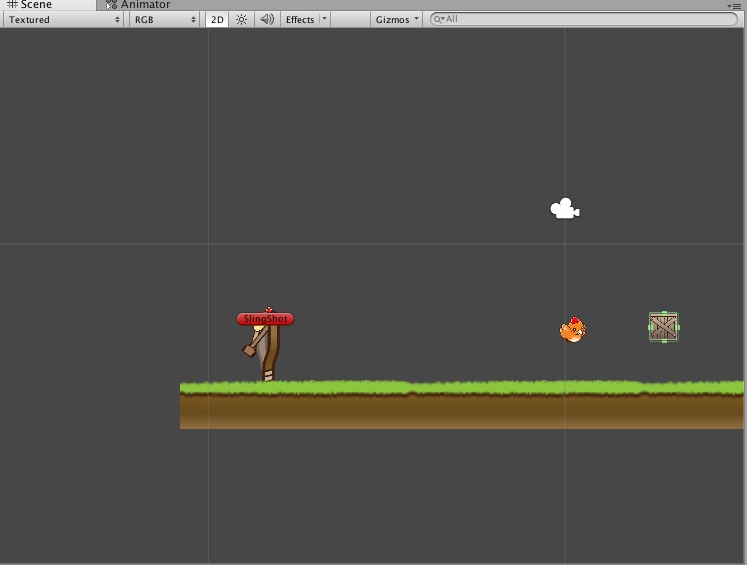
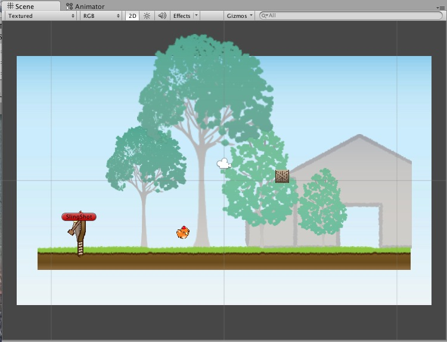
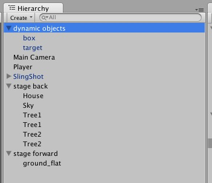

#【初期設定】

Unityのパッケージをインポート。

まずはUnityの画面を同じにしましょう。
以下の点を設定して下さい。

-  画面右上の **Layout** を **2 by 3** に変更
-  画面左上のボタンを **pivot** と **Global** に変更
-  Sceneの **2D** を押して2DモードをONに設定
-  GameのFreeAspectを **16:9** に変更


##Unityエディタの使い方

###とりあえず画像を表示しよう

とりあえず画像を表示します。

ProjectビューでImages>Player>PlayerFly0を選択、
InspectorのTextureTypeをSpriteに変更し、Apply。
後は、スプライトをSceneビュー（左上のSceneと書いてあるタブの灰色部分）にドラッグ＆ドロップ。

これでスプライトが表示出来ました。

###エディタの操作を確認しよう

とりあえずスプライトが表示出来た所で、各ビューの使い方について説明します。

>**左上：Scene ビュー**
>
>この シーン ※を 3D 空間的に覗くためのビューです。このビューから、各ゲームオブジェクトが 3D 空間上>に、どのように配置されているのか確認することができます。詳しい操作方法については後ほど解説します。
>
>**左下：Game ビュー**
>
>ゲームの実行状態をプレビューするためのビューです。さきほど、このビューの中で Angry Bots をプレイしたので、なんとなく分かりますね。

>**中央左：Hierarchy ビュー**
>
>ゲームオブジェクトのリストを表示するビューです。また、ゲームオブジェクトに親子関係がある場合、その構造をここで確認することができます。Windows のエクスプローラーのツリー表示に近いですね。

>**中央右：Project ビュー**

>このゲーム内に含まれるデータファイルを表示するビューです。ここにファイルをドラッグ＆ドロップすることで、ゲームにファイルを追加することができます。

>**右：Inspector ビュー**

>現在選択されているものの情報を表示するビューです。Scene ビューや Hierarchy ビューでゲームオブジェクトを選択した場合は、そのゲームオブジェクトの情報を表示します。Project ビュー上でファイルを選択した場合は、そのファイルの情報を表示します。

>**※シーン**：日本語だと「ステージ」とか「面」とか、そういった概念

###とりあえず覚えておく3操作

これからゲームを作るにあたって、とりあえず3つの操作を覚えて下さい。

1.  Inspectorをからダブルクリックすると、対象のオブジェクトを注目する
2.  Alt押しながらシーンをドラッグすると平行移動する
3.  マウスホイールをスクロールすると拡大縮小

先ほど追加した鳥を中心に、色々と動かしてみましょう。

#【世界をつくろう】

では、早速ゲームを作っていきましょう。
まずはSceneを新しく作ります。

**メニュ→ File → new Scene**を選択。
画面から物がなくなりましたね。

作成したシーンは保存しましょう。（大事）
**メニュー　→　File　→　Save Scene** を選択。名前は「**stage 1**」とします。

##世界に物を配置する

まずは、地面の作成から。

ProjectビューのFavoritesのAllTexturesを選択します。全てのTextureが表示されますので、TextureTypeをSpriteに変更します。

その後、**back ground>stage>ground_flat**を選択しSceneビューにドラッグ＆ドロップします。ground_flatスプライトは**Position(0,-4.5,0)**、**scale(5,5,1)**に設定します。


ここで簡単に、スプライトについての操作について。

1.  スプライトを選択してドラッグするとスプライトが動く
2.  スプライトの右上を選択してドラッグすると、スプライトが回る
3.  スプライト端の青い玉をドラッグすると、サイズが変わる

同じ要領で障害物もつくりましょう。

画面の真ん中付近に配置。
**position(2,0,0)**、**Scale(0.5,0.5,1)**に設定。

最後に当たり判定を追加しよう。
**ground_flat**と**box**を選択し、2つを選択して、**Add Component→Box Collider 2D**を選択します。これで当たり判定が生成されました。

同様にImages>Targetの**Target_Normal**もシーン内に配置しておきましょう。
座標は適当で良いですが、**scaleは(0.3, 0.3,1)**とします。
名前も変更しておきます。Target_Noramlを選択してInspectorから**target**に変更しましょう。

**ここで実際にプレイしてみてください**

何も起きませんね。

>###Tips!

>ここでプレイを止めないで編集してしまうと、変更作業が「プレイ中」に起こったことと見なさます。そしてその後、プレイを止めると、編集作業が全てパーになります。

>なので編集する際は必ず「プレイを止める」ことをお忘れなく！

>で、今プレイ中かどうかを知る、Tipsをここだけに教えちゃいます。
これはかなりいいテクニックなので、やってみて下さい。

>**Unity→Preference** を選択して、Colorの項目の **Playmode tint** の色をお好きな色にして下さい。どきつい色が良いですが、ゲーム画面が見難くなるので適当に。

>こうすると、プレイ中は色が変わるので、プレイ中かどうかが一目瞭然になる。

##物理属性を追加

次に**box**と**target**選択し、**Add Component→Rigidbody2D**を選択。
これでボックスが落下するようになります。

**再生!**  

ボックスの作る当たり判定が気に入りませんか？　そんな時はスプライトを選択しながらShiftを押して、ボックス当たり判定の大きさを調整しましょう。
そうですね、土が見える辺りまで調整しておきましょう。具体的には、**Sizeが(4.3, 0.23)**、**Centerが(0, -0.017)**位です。

次に物理挙動を追加します。
Projectビューの左上の**Create>PhysicsMaterial2D**を追加し、名前は、**PhysicsMaterial**としておきます。

パラメータは、**Friction（フリックション）を0.4**、 **Bounciness（バウンシネス）も0.4**に設定します。
作成後は**box**と**target**を選択しドラッグ＆ドロップして登録します。

**再生!**  

これでブロックが若干跳ねましたね。気に入らなければどんどん調整しましょう。

##ブロックを量産可能にしておく

とりあえず形になったので、**Prefab**に保存しておきましょう。
Prefabはオブジェクトのテンプレートのような物です。

まずはProjectビューのAssetsを右クリックし、**Create→Foldor**を選択します。フォルダが作成されますので名前をprefabとします。

Herarchyの**Box**を選択してProjectビューのprefabフォルダにドラッグ＆ドロップします。

文字が青くなれば成功。以降はPrefabで変更した値はシーンビューにダイレクトに反映されます。
例えばBoxのSpriteRendererのColorを弄ってみよう。シーンビューに配置されているオブジェクトの色も変更されるのが分かりますね。
同様に**target**もprefabフォルダにドラッグ＆ドロップします。

今後はBoxやTargetに変更を加えるときは、prefabからアクセスするようにしましょう。


##アニメーションのあるキャラクターの追加

プレイヤーにはアニメーションがあるので、アニメーションを設定します。

**Player_Fly0とPlayer_Fly1の2つを選択して、シーンビューにドラッグ＆ドロップ**します。するとAnimationが生成されます。名前は**Fly@Player**と設定しておきましょう。

**再生!**  

ゲームを再生すると、鳥が羽ばたくのが確認出来ますね。

シーンを見てください。**Player_Fly0**が確認出来ますね。ただ、これはシーンとテクスチャ名で紛らわしいので、**Player**とリネームましょう。リネームするには、Inspector上のPlayer_Fly0を選択し、名前を**Playerに変更**します。

また少し画像が大きいので、**Scaleを(0.3, 0.3, 1)**に設定しましょう。


次にProjectビューを見て下さい、Player_Fly0もしくはPlayer_Fly1というファイルが新しく追加されています。これはアニメーションを管理するファイルです。とりあえず名前を**PlayerAnimatorControllerに変更**しておきましょう。

同様に、Targetのアニメーションも追加しておきましょう。
Image>targetを開き、**Target_Shirome**と**Target_Boucho**を選択、先ほど作成したTarget_Normalにドラッグ＆ドロップします。
アニメーションファイル名は**Hit@Target**に変更、Player_Fly0と同様に作成される四角いファイルは**TargetAnimatorController**に変更しておきましょう。

###アニメーションのあるキャラクターに物理演算を追加する

さて、次にPlayerに物理演算を追加します。

先ほどと同様に、作成したPlayerに **Add Component** から **Rigidbody2D** と **CicleCollider2D** を追加します。　また、**PhysicsMaterial**をPlayerにドラッグ＆ドロップで登録する。
**Circlecollider2D**のradiusは1に設定しておきます。

**再生！**

今度は落下しません。Animatorの**Apply Root Motion**にチェックが入っているからです。これはアニメーションの移動をゲーム内に再現する機能ですが、スプライトアニメーションでは要らないのでOFFにしましょう。


**再生！**

今度は落下しましたか？
targetにもanimatorが追加されているので、**Apply Root Motion**のチェックを外しておきましょう。

#【ゲームルールの追加】

さて。このままではまだゲームとは呼べません。何もプレイヤーは入力できませんし、オブジェクトは何も反応しませんしね。

では、まずは、スクリプトを作ってみましょう。大丈夫コワクナイヨー。

今回は何か強く当たったら消える、という機能を作ります。

##スクリプトの作成

フォルダ(Assets/Scripts)を作成し、Assets→Create→C#を選択。
スクリプトの名前は**CrashBlock.cs**とします。

ソースコードはこのような形で。

```
using UnityEngine;

public class CrashBlock : MonoBehaviour
{
	void OnCollisionEnter2D(Collision2D col)
	{
		Destroy(gameObject);
	}
} 
```

その後、このオブジェクトをProjectビューのプレハブの**Box**と**target**にアタッチします。アタッチ方法はドラッグ＆ドロップでも良いですし、Boxやtargetを選択後Add Component→Script→CrashBlockでも良いです。

こうすれば、シーンビューに配置されたBox達に「接触時に破損する」機能が追加されます。


**実行!**

ブロックが地面に接触したタイミングで破損したと思います。

これはオブジェクトが衝突している際に呼ばれる関数を作ったところです。
つまりこれが呼ばれる時点で衝突しているということになりますね。


>   **void OnCollisionEnter2D(Collision2D col)**は、rigidbody2Dのがアタッチされているオブジェクトが接触した際に呼ばれる命令です。この際**Collision col**には接触対象の情報が入ります。  
接触命令は本件の他に、OnCollisionExit2DやOnCollisionEnter2D等があります。

##パラメータの追加

怒る鳥は強い衝撃を受けた際に壊れるゲームなので、同様に衝撃に強くします。具体的には、衝撃でブロックにダメージが入り、HPが0になったら破壊されるルールを作ります。

```
using UnityEngine;

public class CrashBlock : MonoBehaviour
{
	public float m_Strength = 1, m_hp = 1;

	void OnCollisionEnter2D(Collision2D col)
	{
		float damage = col.relativeVelocity.magnitude - m_Strength;
		if (damage > 0){
			m_hp -= damage;
		}

		if (m_hp < 0){
			Destroy(gameObject);
		}
	}
}
```

**collisionInfo.relativeVelocity.magnitude**は衝撃が与えられた際の相対速度です。つまり、m_Strength以上の速度でぶつかるとダメージが入る…といったルールです。

さて、Unityエディタに戻り再生してみましょう。
壊れませんか？　壊れますね？

硬さが足りません。もっと硬くします。
Boxのインスペクターを確認すると、Strengthパラメータが追加されているので、こちらを変更します。
**Strengthを4くらい**に、**HPは…5くらい**が良いでしょう。

Targetはもっと壊れやすくても良いので、**strangthは2**, **hpも2**程度にします。


##入力を受け付ける

次に入力を受付ますが、面倒なのですでにある物を使います。

**Slingshot.unitypackage**をインポートして下さい。

そしたらSlingshotフォルダ以下に**SlingShotプレハブ**が生成されますので、これをシーン…**position(-8,-1.6,0)**に配置して下さい。

後はプレイヤーにちょっとした仕込みを行います。

-  Playerのpositionを(-8.4, -2.1, 0)に移動
-  Rigidbody2DのIsKinematicにチェックを入れる
-  Tagを「Player」に変更

さて、これで準備はOKです。早速再生してみましょう。

**再生！**

プレイヤーをドラッグ＆ドロップして発射できるようになりましたか？出来ない場合は、上の設定をもう一度確認して下さい。

こういった有り物のシステムを簡単に組み込めるのもUnityの特徴の一つです。



##エフェクトを追加する

さて、壊れるのは良いですが地味なので、エフェクトを追加します。
簡単に、オブジェクトが壊れた時にエフェクトを呼ぶスクリプトを記述しましょう。

```
using UnityEngine;

public class CrashBlock : MonoBehaviour
{
	public float m_Strength, m_hp;
	public GameObject m_Effect;

	void OnCollisionEnter2D(Collision2D col)
	{
		float damage = col.relativeVelocity.magnitude - m_Strength;
		if (damage > 0){
			m_hp -= damage;
		}

		if (m_hp < 0){
			Destroy(gameObject);
			Object effect = GameObject.Instantiate(
					m_Effect, 
					transform.position, 
					Quaternion.identity);
			DestroyObject(effect, 1.5f);
		}
	}
}
```

Unityエディタに戻り、CrashBlockのパラメータを確認して下さい。effectの項目が追加された事がわかりますか？そこにエフェクトを登録すれば、このブロックが壊れた際にエフェクトを生成してくれます。

さっそくエフェクトを登録しましょう。といっても、表示するエフェクトを作るのも出来合いのものを使います。

Effect.unitypackageをインポートして下さい。EffectフォルダがProjectビューに追加されましたね。

インポートが完了したら**box**プレハブを選択し、エフェクトの右の「ぽっち」を選択、**bamb**を選択します。**target**も同様に選択欄を開き**break**を選択します。


**再生!!!**

クラッシュした時、エフェクトが表示されましたか？

#【アニメーションを制御する】

次は、**player**や**Target**が物にぶつかった時のアニメーションを作っていこうと思います。

先ほど作ったPlayerAnimatorControllerを覚えていますか？それを使ってアニメーション制御のシステムを作ってみましょう。

まずはPlayerのターン、**Player_Fly2とPlayer_Fly3を選択してScene上のPlayerにドラッグ＆ドロップ**します。
すると、前回同様にアニメーション名を設定するウィンドウが表示されますので**Hit@Player**と設定します。

ここで**PlayerAnimatorController**を見てみましょう。中身を見るにはPlayerAnimatorControllerをダブルクリックしましょう。FLy@PlayerとHit@Playerというステートが見えると思います。


ではSceneのPlayerを選択してからゲームを再生してみてください。Fly@Playerのバーが前後し続ける事が分かりますね。これが「現在再生中のアニメーション」です。

では、この挙動に「衝撃を受けたらHit@Player」を再生するように設定してみましょう。

##ステートの遷移

この操作は「考えるな感じるんだ」なので、よく見ていて下さい。

まず**Parametersの右の「＋」ボタンをクリック**し、**Trriger**を追加します。New Triggerが追加されますので、名前を**Hit**に変更します。

次に、**Fly@Playerを右クリック**し**Make Transition**を選択。**Hit@Player**までドラッグ＆ドロップします。

先ほど追加した矢印を選択し、Inspector右のConditionのExit Timeを**Hit**に変更します。

ではSceneビューの**player**を選択し再生してみてください。

**再生!**

再生中、ParametersのHitにチェックを入れると、Fly@PlayerからHit@Playerにアニメーションが遷移するのが分かります。

つまり先ほど設定した「矢印の方向にアニメーション遷移、Hitしたら」が成立しているということです。

今度は一定時間経ったらアニメーションを戻すようにしましょう。

**Hit@Player**を右クリックして**Make Transition**を選択、**Fly@Player**へドラッグ＆ドロップ。　戻る条件は、時間にしておきます。　**Exit Timeを3.00**と設定しましょう。

**再生!**

Hitにチェックが入った瞬間からしばらくHit@Playerが再生されていますか？


##アニメーションのスクリプト制御

それでは、このHitにチェックを入れるソースコードを作成します。

ScriptフォルダにCharacterAnimatorControllerを作成し、以下のソースコードを追加して下さい。

```
using UnityEngine;

public class CharacterAnimatorController : MonoBehaviour
{
	void OnCollisionEnter2D(Collision2D col)
	{
		GetComponent<Animator>().SetTrigger("Hit");
	}
}
```

作成が終わったら、Playerにアタッチしてプレイヤーを飛ばしてみてください。何かにぶつかった時に表情が変化しましたか？

##手動でアニメーションを作成する

先ほどからアニメーションの変化時間や並び順等はかなり適当にやっていますが、これを手動でやるにはどうすれば良いのでしょうか。

では、アニメーションを人力で設定で設定してみましょう。

まず、**メニュー→window→Animation**でアニメーションウィンドウを表示します。次にtargetを選択すると、アニメーションキーフレームが確認出来ます。


次に左上の**HIt@Target**と書かれている項目を選択し、**Create New Clip**を選択します。今までと同様に名前を聞かれるので、**Idle@Target**としておきます。


ではアニメーションを追加します。

1.  AddCurveを押し、**Sprite Renderer>Sprite**を追加。
2.  0:50の下に**Target_Shirome**をドラッグ＆ドロップ。
3.  位置が気に入らなければ、◇をクリックしドラッグ＆ドロップで動かす。

これでアニメーションが追加されました。

###アニメーション作成のおさらい

それでは、Playerと同様にアニメーション遷移を作ってみましょう。

まず**Parametersの右の「＋」ボタンをクリック**し、**Trriger**を追加します。New Triggerが追加されますので、名前を**Hit**に変更します。

次に、**Idle@Targetを右クリック**し**Make Transition**を選択。**Hit@Player**までドラッグ＆ドロップします。

先ほど追加した矢印を選択し、Inspector右のConditionのExit Timeを**Hit**に変更します。
**Hit@Target**を右クリックして**Make Transition**を選択、**Idle@Target**へドラッグ＆ドロップ。　戻る条件は、時間にしておきます。　**Exit Timeを3.00**と設定しましょう。

実際に再生してみましょう。最初にHitアニメーションが始まってしまいますね？　これはDefaultが**Hit@Target**に設定されているからです。Idle@Targetに設定するにはAnimatorウィンドウからIdle@Targetを右クリックしSet as Defaultを選択しましょう。

最後にPlayerと同じく**CharacterAnimatorController**スクリプトをアタッチして完成です。

#【スプライトの描画順を制御する】

最後に背景を作りこみましょう。

##レイヤー単位のスプライトの描画順設定

まずは空を作成します。
Image>back ground>Skyをシーンに配置します。その後、**position(0,0,0)**、**scaleを(600,3,1)**と設定しましょう。これで背景が空になりました。

このように小さい画像を引き伸ばすことでメモリの節約になります。

もしかしたら画像の描画順の問題で空が手前になっているかもしれません。そんな時はレイヤーを活用します。

**Sky>SpriteRenderer>Sorting Layer** を選択し、Add Sorting Layerを選択。Sorting Layersを開き「＋」をクリック、**BackGroundレイヤー**と**Forwardレイヤー**を追加します。

次にレイヤー左の「=」をドラッグ＆ドロップしレイヤーの並び順を変更します。並び順は上から「**BackGround、Default、Forward**」とします。


最後にシーンビューのSkyを選択してSorting LayerをBackGroundに変更してみましょう。これで描画順が後方になりました。

またground_flatを選択して**forward**に設定しておけば、どのオブジェクトよりも前に表示されるのが分かります。

## 同一レイヤー上のスプライト描画順

背景に家を建てたり物を柵を建てたり、木をはやしたりしてみましょう。
方法は簡単です。例として木をはやしてみましょう。

1.  Images>back ground>Tree1をドラッグ＆ドロップしてシーンに配置
2.  tree1のSorting LayerをBackGroundに変更

もし手前にスプライトを表示したい場合は Sorting Layerをforwardに設定してみましょう。手前に表示されますね。

同じレイヤーで描画順を変更したい場合は、**Order in layer**を変更してみてください。大きいほうが手前、小さいほうが奥の順に描画されます。

特にSkyは確実に最後尾になるべきなので、Order in layerを-100くらいに設定しておきましょう。



ここでワンポイントアドバイス。
**vキー**を押しながらスプライトを移動すると、スプライトの角が他の角に吸い付くような感じで動作します。スプライトの高さを合わせる際に非常に有効なので、是非活用して下さい。

##オブジェクトの整理

最後に、シーン上にゴチャゴチャと物が増えると管理が面倒なので、少し整理しましょう。

-  ３つの空オブジェクトを生成します。名前はそれぞれ、「stage back」「stage forward」、「dynamic objects」とします。
-  生成したオブジェクトのpositionを(0,0,0)、scaleを(1, 1, 1)とする

後は、オブジェクトを各オブジェクトにドラッグ＆ドロップして格納していきます。例えば

-  boxたtargetといった、ゲームに影響する・動く・壊れるといった物は**dynamic objects**、
-  skyやtreeといった背景として描画するものは**stage back**、
-  ground_flatやfanceといった手前に描画する物は**stage forward**

親子構造にする前に必ず**positionやscaleが初期化されている事を確認**して下さい。Unityでは親子構造にした場合、親の位置や大きさが子に影響します。
また、子の座標はグローバル座標から相対座標になります。



-

これでゲームを作る要素は概ね整いました。
さっそくステージを作ってみてください。

オブジェクトをコピー＆ペーストで量産しても良いですし、新しくBlokを追加しても良いです。Targetを増やしても良いですし、クリア条件を決めても良いです。


もしわからない人事があれば遠慮なく周りもしくは自分たちに聞いて下さい。分からない事を分からないままにするのは悪です。

#【extra】

##もっと作りこもう

###音楽の追加
1.  音楽を追加します。[煉獄庭園](http://www.rengoku-teien.com/)や[魔王魂](http://maoudamashii.jokersounds.com/)、[AssetStore](https://www.assetstore.unity3d.com/#/category/78)からダウンロードしインポートします。
2.   インポートした音楽ファイルを選択し、**3d sound**のチェックを外します
3.  空のGameObjectを作成し、名前をMusicに変更、先ほどインポートしたオーディオファイルをドラッグ＆ドロップします。

###爆発する効果音の追加

1.  先ほどと同じ手順で爆発音をインポート（3d soundのチェックは外す）
2.  Effect>breakやEffect>Bombにドラッグ＆ドロップで登録

###発射音の追加

1.   効果音をインポート（3d soundのチェックは外す）
2.   Slingshot>Slingshot.csを開き、 **void Update()**の上に①のコードを追加。  
  また、64〜68行目を②のように修正。
3.  Scene上のSlingshotにaudioを設定する項目が追加されるので、変更する

①

```
public AudioClip shotAudio;
``` 

②

```
if (diff.magnitude > minPower)
{
	catchObject.rigidbody2D.isKinematic = false;
	catchObject.rigidbody2D.AddForce(diff * power);
	
	AudioSource.PlayClipAtPoint(shotAudio, Vector3.zero); // <- add
}
```

###Playerを2発以上発射出来るようにする

以下の操作で弾発射後一定時間で弾が補充される。

1.  Playerをプレハブ化
2.   シーンのSlingshotのSpawnPlayerのPlayerPrefabにアタッチ

なお、SlingShotのSlinhshotコンポーネントのMaxPowerとMinPowerは、引ける最大値と弾が発射出来る最小値

###オブジェクトに重さを設定する

質量の高い方が吹っ飛ばない。

1.  対象のオブジェクトを選択する。
2.  Rigidbody2Dのmassの値を2〜3と増やす。

*※ゆで理論は適応されないので、重くても落下速度は変わらない*

###凹凸のある地形を設定する

1.  Images>stage>ground_roughのスプライトをシーンに配置する。
2.  配置したスプライトにPolygonCollider2Dをアタッチする。

###スプライトの色を濃くする、透明にする

1.  SpriteRenderのColorを弄る

###揺れる物を作る

振り子の事で、胸や髪ではありません。

1.  接続元となる空のGameObjectを作成し、rigidbody2dをアタッチする。
2.  rigidbody2dのIsKinematicにチェックを入れる。（衝撃・重力では動かなくなる）
3.  揺れるSpriteを作成し、rigidbody2dとdistanceJoin2dをアタッチする。
4.  distanceJoinのConnected Rigidybodyに1で作成した接続元のオブジェクトを設定。  
distanceに適当な距離を設定する。

###テクスチャをパックする

同じタグかつ同じフォーマットのテクスチャを1枚のテクスチャにパックする。

1.  各スプライトのpacking tagに適当な名前  
（例えばPlayer関連はPlayer、backgroundはbackground)と設定
2.  メニュー>WIndow>SpritePackerを選択
3.    SpritePacker左上のPackを選択

現状developer previewなので、Textureをtexturepacker等でまとめてしまう方が有効。
http://terasur.blog.fc2.com/blog-entry-621.html